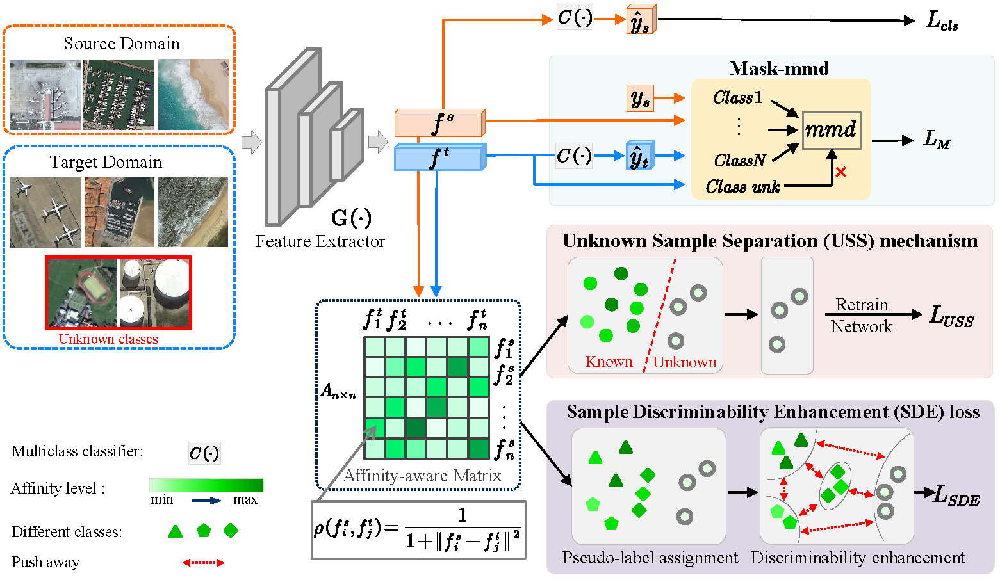

# IAFAN
The code of the paper [Open Set Domain Adaptation via Instance Affinity Metric and Fine-grained Alignment for Remote Sensing Scene Classification](https://ieeexplore.ieee.org/document/10128141) (IEEE GRSL 2023)

## Abstract
In the practical application of remote sensing scene classification (RSSC), domain adaptation is introduced to handle the situation where the distribution of training data (source) and test data (target) is different. Compared to general domain adaptation, open set domain adaptation (OSDA) is suitable for more realistic situations where there are additional unknown classes in the target domain. The key to solving this problem is
to separate unknown samples from target data to avoid negative transfer caused by mismatching unknown/known samples. In this letter, we propose a novel and effective method, named Instance Affinity metric-based Fine-grained Adaptation Network (IAFAN), for OSDA in RSSC. Concretely, an Unknown Sample Separation (USS) mechanism based on the instance affinity-aware matrix is pioneeringly proposed to endow the model with the ability to distinguish unknown samples. In addition, considering the high inter-class similarity and rich intra-class diversity of remote sensing images, we introduce the Sample Discriminability Enhancement (SDE) loss to further increase the inter-class distance and narrow the intra-class difference, thereby alleviating the negative transfer caused by sample misclassification and mismatching. In the feature confusion stage, we specially design Mask-mmd for OSDA as an adaptation metric to conduct semantic fine-grained cross-domain alignment of known samples while keeping unknown samples out of alignment, which avoids negative transfer during the adaptation process. Finally, we evaluate IAFAN on transfer tasks between different public remote sensing datasets, and the results verify that our method significantly outperforms previous methods in RSSC.<br>


## Usage
### Request
numpy==1.21.4<br>
python==2.8.10<br>
torch==1.10.0<br>
torchvision==0.11.1<br>
tensorflow==2.4.1
### Train
```
python IAFAN.py
```

## Citation
If you find this repository/work helpful in your research, welcome to cite the paper.
```
@ARTICLE{10128141,
  author={Niu, Ben and Pan, Zongxu and Chen, Keyang and Hu, Yuxin and Lei, Bin},
  journal={IEEE Geoscience and Remote Sensing Letters}, 
  title={Open Set Domain Adaptation via Instance Affinity Metric and Fine-Grained Alignment for Remote Sensing Scene Classification}, 
  year={2023},
  volume={20},
  number={},
  pages={1-5},
  doi={10.1109/LGRS.2023.3276968}}
```
